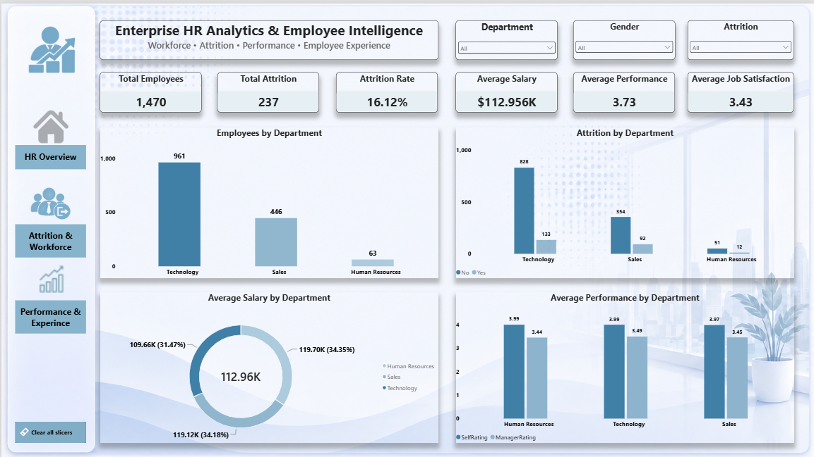
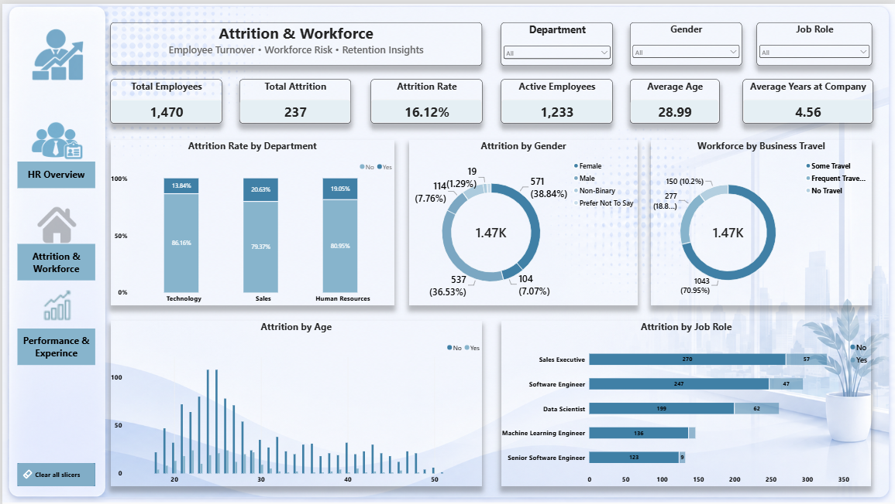
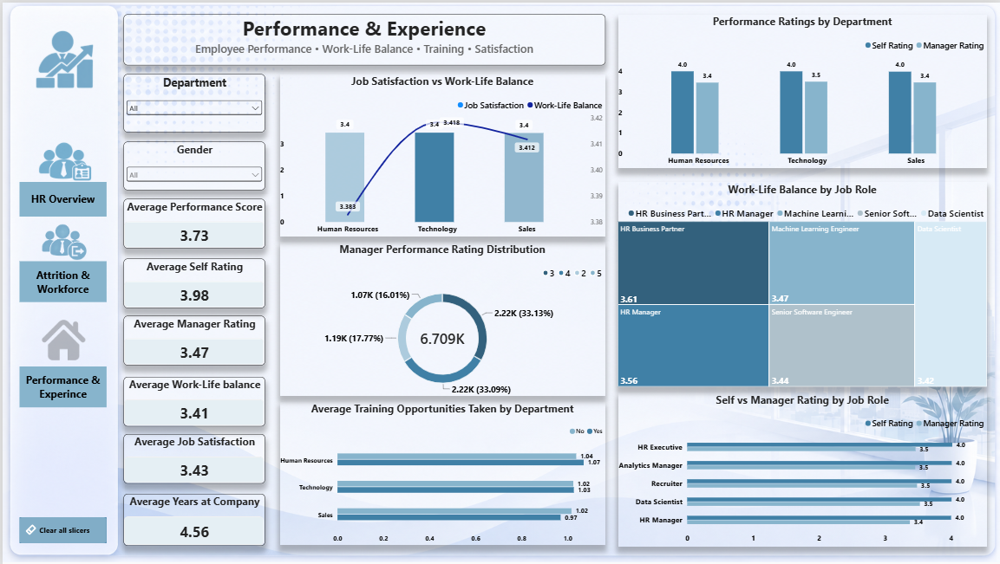

# Enterprise HR Analytics & Employee Intelligence

An end-to-end HR Analytics project focused on understanding workforce trends,
employee attrition, performance, satisfaction, compensation, and employee
experience using SQL, Python, Excel, and Power BI.

---

## 📊 Dashboard Preview

### HR Overview



### Attrition & Workforce



### Performance & Experience



---

## 📌 About the Project

This project analyzes employee and performance data to understand different
aspects of the workforce and provide useful business insights for HR teams.

I followed a complete data analytics workflow from raw data to an interactive
Power BI dashboard:

**Kaggle → MySQL → Python → Excel → Power BI**

The project covers data preparation, validation, exploratory analysis,
business analysis, KPI development, and interactive visualization.

---

## 🎯 Business Questions

The project focuses on questions such as:

- How large is the current workforce?
- What is the overall employee attrition rate?
- Which departments have higher attrition?
- Which job roles have higher employee turnover?
- How does salary vary across departments?
- How satisfied are employees with their jobs?
- How is work-life balance across different job roles?
- How do employee self-ratings compare with manager ratings?
- How many training opportunities are being used?
- What are the major workforce characteristics?

---

## 📊 Dataset

The project uses two datasets.

### Employee Dataset

- **1,470 employees**
- **23 columns**
- Employee demographics
- Department and job role
- Salary and compensation
- Business travel
- Attrition
- Employee tenure

### Performance Dataset

- **6,709 performance records**
- **11 columns**
- Review information
- Environment satisfaction
- Job satisfaction
- Relationship satisfaction
- Training opportunities
- Work-life balance
- Self rating
- Manager rating

---

## 🛠️ Tools & Technologies

| Tool | Purpose |
|---|---|
| Kaggle | Data source |
| MySQL | Database creation, validation and SQL analysis |
| Python | Data cleaning and exploratory data analysis |
| Pandas | Data manipulation |
| Jupyter Notebook | Python analysis |
| Excel | Pivot analysis and KPI analysis |
| Power BI | Interactive dashboard |
| GitHub | Project documentation and version control |

---

# 🔄 Project Workflow

## 1. Data Collection

The employee and performance datasets were collected from Kaggle.

The datasets were reviewed to understand their structure, fields, and
relationship between employee and performance information.

---

## 2. MySQL

The datasets were loaded into a relational MySQL database.

The SQL analysis included:

- Database creation
- Table creation
- Data loading
- Data validation
- Basic analysis
- Intermediate analysis
- Advanced analysis
- Employee and performance table relationships

---

## 3. Python / Jupyter

Python was used for data cleaning, validation, and exploratory analysis.

The analysis included:

- Data loading
- Data quality checks
- Duplicate checks
- Missing-value analysis
- Data type conversion
- Data cleaning
- Exploratory Data Analysis
- Workforce analysis
- Attrition analysis
- Salary analysis
- Satisfaction analysis
- Performance analysis
- Department KPI analysis

---

## 4. Excel

Excel was used for additional business analysis and reporting.

The Excel work included:

- HR data preparation
- PivotTable analysis
- KPI analysis
- HR dashboard

---

## 5. Power BI

The cleaned data was connected to Power BI to create an interactive
three-page HR Analytics dashboard.

The Power BI report includes:

- Data modeling
- DAX measures
- KPI cards
- Interactive slicers
- Multiple chart types
- Page navigation
- Professional dashboard design

---

# 📈 Power BI Dashboard

## 1. HR Overview

Provides a high-level view of the organization and workforce.

### KPIs

- Total Employees
- Total Attrition
- Attrition Rate
- Average Salary
- Average Performance
- Average Job Satisfaction

### Visualizations

- Employees by Department
- Attrition by Department
- Average Salary by Department
- Average Performance by Department

---

## 2. Attrition & Workforce

Focuses on employee turnover and workforce characteristics.

### KPIs

- Total Employees
- Total Attrition
- Attrition Rate
- Active Employees
- Average Tenure
- Average Age

### Visualizations

- Attrition by Department
- Attrition by Gender
- Attrition by Age
- Attrition by Job Role
- Workforce by Business Travel

---

## 3. Performance & Experience

Focuses on employee performance, satisfaction, training, and workplace
experience.

### KPIs

- Average Performance Score
- Average Self Rating
- Average Manager Rating
- Average Job Satisfaction
- Average Work-Life Balance
- Average Years at Company

### Visualizations

- Performance Ratings by Department
- Job Satisfaction vs Work-Life Balance
- Training Opportunities by Department
- Work-Life Balance by Job Role
- Manager Performance Rating Distribution
- Self vs Manager Rating by Job Role

---

# 🔑 Key KPIs

| KPI | Result |
|---|---:|
| Total Employees | 1,470 |
| Total Attrition | 237 |
| Attrition Rate | 16.12% |
| Average Salary | 112,956.50 |
| Average Age | 28.99 |
| Average Years at Company | 4.56 |
| Average Performance Score | 3.72 |
| Average Job Satisfaction | 3.42 |
| Average Work-Life Balance | 3.41 |
| Average Self Rating | 3.98 |
| Average Manager Rating | 3.47 |

---

# 💡 Business Insights

The analysis provides visibility into:

- Overall workforce size and composition
- Employee attrition levels
- Department-level attrition
- Job-role workforce distribution
- Employee satisfaction
- Work-life balance
- Performance rating differences
- Training participation
- Salary patterns
- Employee tenure

These insights can help HR teams understand workforce patterns and support
better decisions around employee retention, engagement, performance, and
workforce planning.

---

# 🧠 Skills Demonstrated

## SQL

- Database Design
- Table Relationships
- Joins
- Aggregations
- Filtering
- CTEs
- Window Functions
- Data Validation

## Python

- Pandas
- Data Cleaning
- Data Validation
- Exploratory Data Analysis
- Data Transformation
- Aggregation
- KPI Analysis

## Excel

- PivotTables
- KPI Analysis
- Dashboard Creation

## Power BI

- Data Modeling
- DAX
- KPI Cards
- Interactive Slicers
- Data Visualization
- Page Navigation
- Dashboard Design

---

# 📁 Project Structure

```text
Enterprise-HR-Analytics-Employee-Intelligence/
│
├── 01_Kaggle_Data/
│   ├── Employee.csv
│   ├── PerformanceRating.csv
│   └── README.md
│
├── 02_MySQL/
│   ├── 01_create_database.sql
│   ├── 02_create_tables.sql
│   ├── 03_load_data.sql
│   ├── 04_data_validation.sql
│   ├── 05_basic_analysis.sql
│   ├── 06_intermediate_analysis.sql
│   └── 07_advanced_analysis.sql
│
├── 03_Python_Jupyter/
│   ├── 01_Data_Loading.ipynb
│   ├── 02_Data_Cleaning.ipynb
│   ├── 03_EDA.ipynb
│   └── department_kpi_summary.csv
│
├── 04_Excel/
│   ├── 01_HR_Data.xlsx
│   ├── 02_Pivot_Analysis.xlsx
│   ├── 03_HR_KPI.xlsx
│   └── 04_HR_Dashboard.xlsx
│
├── 05_PowerBI/
│   └── Enterprise_HR_Analytics.pbix
│
├── 06_Reports/
│   └── Enterprise_HR_Analytics_Report.pdf
│
├── 07_Visualizations/
│   ├── 01_HR_Overview.png
│   ├── 02_Attrition_Workforce.png
│   └── 03_Performance_Experience.png
│
├── 08_Icons/
│   ├── HR_Overview_Icon.png
│   ├── Attrition_Icon.png
│   └── Performance_Icon.png
│
└── README.md
